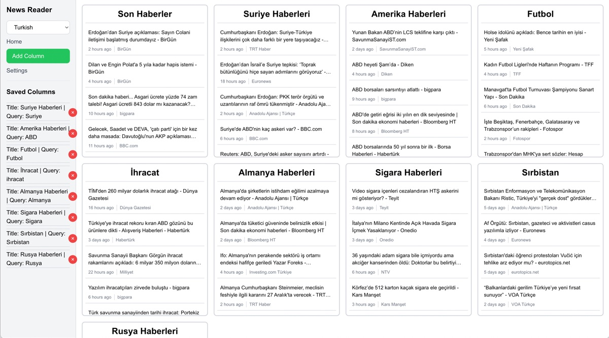

# Next.js News Application

A modern news aggregation application built with Next.js, featuring multi-language support and customizable themes.



## Features

- 🌐 Multi-language news support
- 🎨 Light/Dark theme switching
- 📱 Responsive design
- ⚡ Server-side rendering
- 🔍 Topic-based news filtering
- ⚙️ Customizable settings

## Tech Stack

- [Next.js 14](https://nextjs.org/) - React framework
- [TypeScript](https://www.typescriptlang.org/) - Type safety
- [Tailwind CSS](https://tailwindcss.com/) - Styling
- [Next.js API Routes](https://nextjs.org/docs/api-routes/introduction) - Backend API

## Getting Started

1. Clone the repository:
```bash
git clone <your-repo-url>
```

2. Install dependencies:
```bash
npm install
# or
yarn install
# or
pnpm install
```

3. Create a `.env.local` file in the root directory and add your environment variables:
```env
# Add any required API keys or configuration
```

4. Run the development server:
```bash
npm run dev
# or
yarn dev
# or
pnpm dev
```

5. Open [http://localhost:3000](http://localhost:3000) with your browser to see the result.

## Project Structure

```
├── app/
│   ├── api/           # API routes
│   ├── settings/      # Settings page
│   └── layout.tsx     # Root layout
├── components/        # Reusable components
├── public/           # Static assets
└── ...
```

## Key Components

- `ThemeProvider` - Manages application theme state
- `Sidebar` - Navigation and layout component
- `LanguageButton` - Language selection interface
- `ContainerWrapper` - Layout wrapper component

## API Routes

- `/api/news` - Main news endpoint
- `/api/news/[language]/[topic]` - Language and topic-specific news

## Contributing

1. Fork the repository
2. Create your feature branch (`git checkout -b feature/amazing-feature`)
3. Commit your changes (`git commit -m 'Add some amazing feature'`)
4. Push to the branch (`git push origin feature/amazing-feature`)
5. Open a Pull Request

## License

This project is licensed under the MIT License - see the LICENSE file for details.

## Acknowledgments

- [Next.js](https://nextjs.org/) - The React Framework
- [Tailwind CSS](https://tailwindcss.com/) - CSS Framework
- [Vercel](https://vercel.com/) - Deployment Platform

## Deploy on Vercel

The easiest way to deploy your Next.js app is to use the [Vercel Platform](https://vercel.com/new).

Check out the [Next.js deployment documentation](https://nextjs.org/docs/deployment) for more details.
